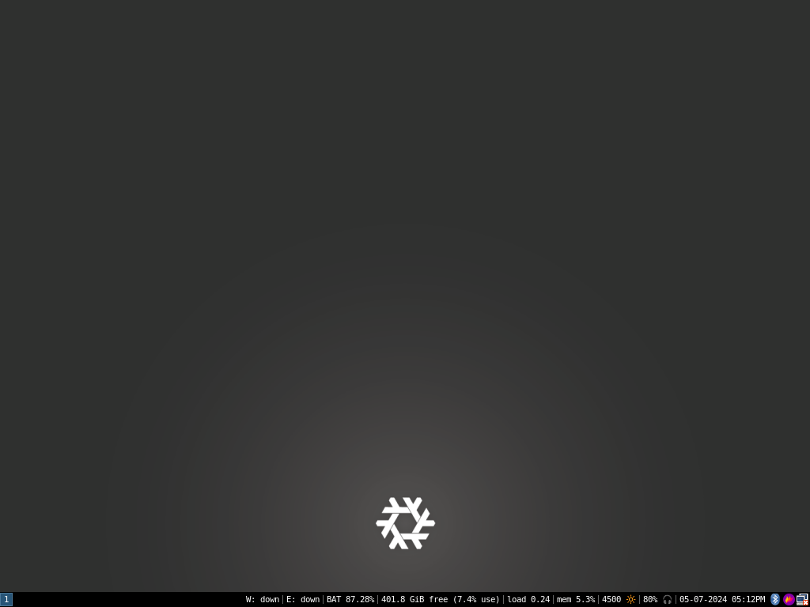

# foundationkitty's NixOS Config(s)
## .config files for my devices:
### - Panasonic Toughbook CF-19-8

Meant to be cloned on top of `~/.config`

`/etc/nixos/` should be symlinked to `nixos`

Copy `nixos/<device-model>.nix` to `device-conf.nix`

Copy `nixos/variables.nix.sample` to `nixos/variables.nix` and fill it in with your information

A file located at `~/.background-image` will be loaded as the desktop and lockscreen background, it must be in PNG format and should have a resolution matching the target device.

Don't forget to generate a `hardware-configuration.nix` with the `nixos-generate-config` command if necessary. 
