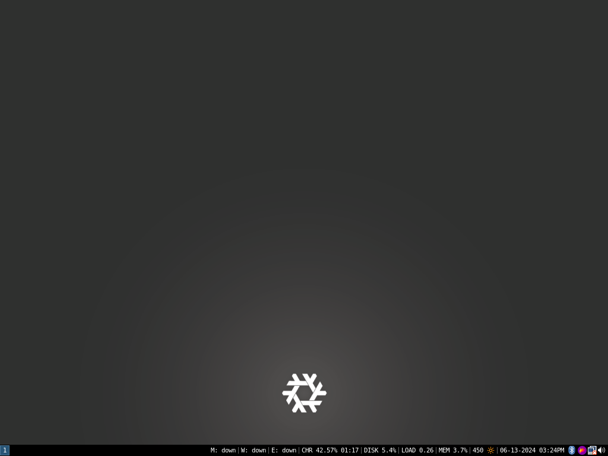

# My NixOS Config
## Dotfiles for my Panasonic Toughbook CF-19 MK8

Meant to be cloned on top of `~/.config`

`/etc/nixos/` should be symlinked to `nixos`

Copy `nixos/variables.nix.sample` to `nixos/variables.nix` and fill it in with your information

A file located at `~/.background-image` will be loaded as the desktop and lockscreen background, it must be in PNG format and should have a resolution of 1024x768

Don't forget to generate a `hardware-configuration.nix` with the `nixos-generate-config` command if neccessary. 
